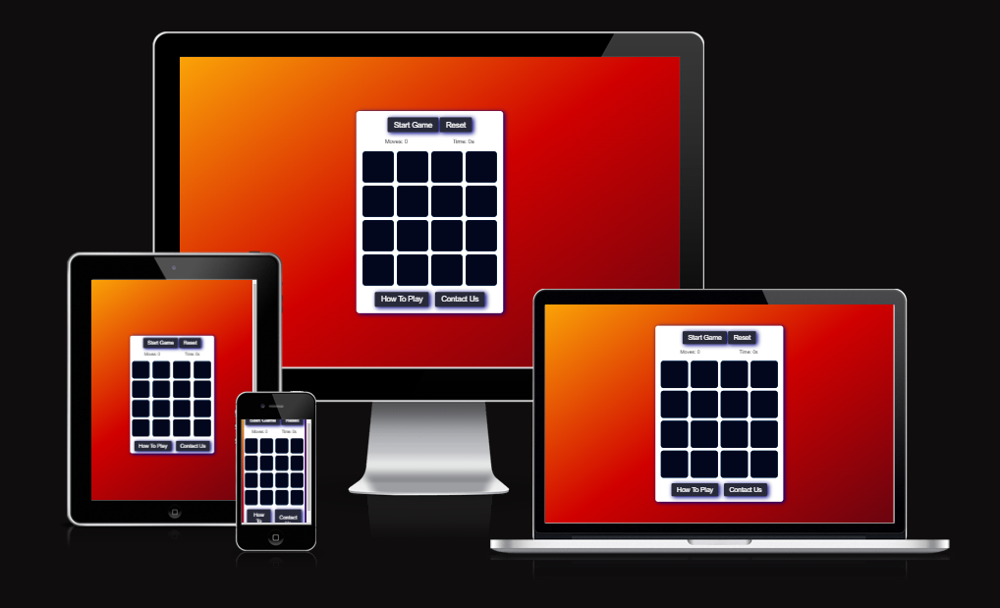

#MemoryGame
<h1 align="center">Memory Card Game</h1>

[View the live project here](https://mariusmilitaru32.github.io/MemoryGame/)

I built this memory card game as a fun and interactive way to challenge the mind and improve memory skills. The concept of the game is simple yet engaging, making it a great pastime for people of all ages. This project allowed me to apply and showcase my skills in JavaScript, HTML, and CSS. It was a great opportunity for me to experiment with different techniques and libraries, and to learn more about Javascript and user experience design.

## Index – Table of Contents
- [Index – Table of Contents](#index--table-of-contents)
- [User Experience (UX)](#user-experience-ux)
- [Features](#features)

## User Experience (UX)

- ### User stories
  - #### A. First Time Visitor
    1. As a first time visitor, I want to easily understand how I to play the game.
    2. As a first time visitor, I want to be able to easily reset the game.
    3. As a first time visitor, I want to be able to easily start the game.
    4. As a first time visitor, I want to be able to easily find how I can get in contact with the business owner.
   
   -   #### B. Returning Visitor 
    1. As a returning visitor, I want to be able to send a quick feedback to the business owner.
    2. As a returning visitor, I want to be able to remember how I can play the game.
   
## Features

