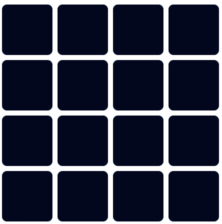

#MemoryGame
<h1 align="center">Memory Card Game</h1>

[View the live project here](https://mariusmilitaru32.github.io/MemoryGame/)

I built this memory card game as a fun and interactive way to challenge the mind and improve memory skills. The concept of the game is simple yet engaging, making it a great pastime for people of all ages. This project allowed me to apply and showcase my skills in JavaScript, HTML, and CSS. It was a great opportunity for me to experiment with different techniques and libraries, and to learn more about Javascript and user experience design.

## Index – Table of Contents
- [Index – Table of Contents](#index--table-of-contents)
- [User Experience (UX)](#user-experience-ux)
- [Features](#features)
- [Design](#design)

## User Experience (UX)

- ### User stories
  - #### A. First Time Visitor
    1. As a first time visitor, I want to easily understand how I to play the game.
    2. As a first time visitor, I want to be able to easily reset the game.
    3. As a first time visitor, I want to be able to easily start the game.
    4. As a first time visitor, I want to be able to easily find how I can get in contact with the business owner.
   
   -   #### B. Returning Visitor 
    1. As a returning visitor, I want to be able to send a quick feedback to the business owner.
    2. As a returning visitor, I want to be able to remember how I can play the game.
   
## Features

- ### Start Game
   As part of the the memory card game, start game button is part of the gaming interface. It helps users to start the game at any time.
 
  

- ### Reset Button
   When clicked, it instantly clears the current game progress and starts a new game. This means all the cards are shuffled and placed face down again, and the score, if applicable, is reset to its initial state.
  
  

- ### Cards grid
  The memory card game is set up on a grid of 4x4, making a total of 16 cards. Each card is a tile that the player can flip by clicking on it. The cards are arranged randomly on the grid at the start of each game.
  There are 8 pairs of matching cards, and each pair has a unique design. The challenge for the player is to remember the locations of each pair as they flip the cards.
  When a card is clicked, it flips over to reveal its design. The goal of the game is to find all 8 pairs by remembering where each card is located. When the player flips over two cards with the same design in succession, it’s a match, and those cards remain face up. If the cards don’t match, they flip back over.

  

- ### How to Play
  The “How to Play” button is designed to help players understand the rules and objectives of the memory card game. When this button is clicked, a pop-up window appears on the screen with detailed instructions on how to play the game.

  

- ### Contact Us
  
  Contact form can be found on contact page. I have included following required fields: name, email address, message/feedback for the developer and the send button which create a post requested to the emailjs.

  

- ### Contact Form confirmation and return to home page
  
  Emailjs has been integrated into the contact form. After the post response is received, a message is displayed to the user to confirm that the email has been sent. Also, an automatic redirect has been implemented after the email-sent message is displayed.

  
  

## Design
  - ### Color scheme
      As part of designing the site I decided to use orange, red and black as main colours. The pallete has been generated using [coolors.co](https://coolors.co/).

  
