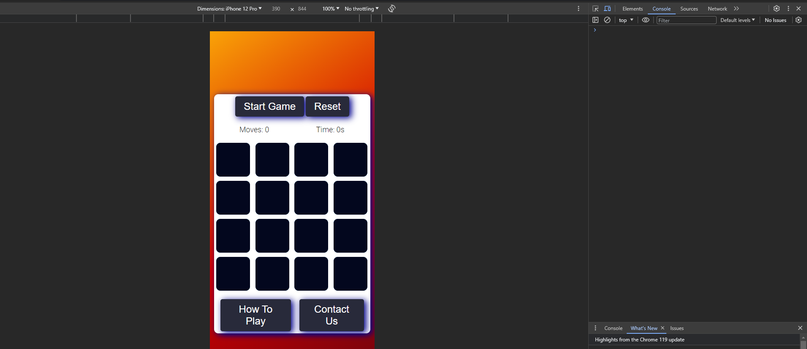
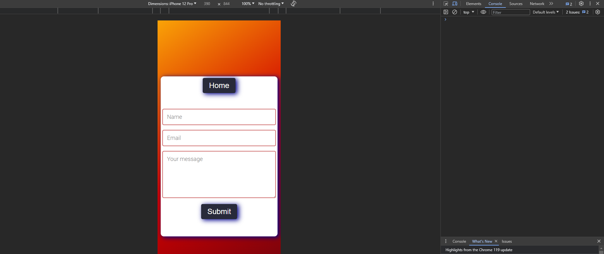

- ### Validator Testing
  - HTML Validator
  - [HTML results home page](https://validator.w3.org/nu/?doc=https%3A%2F%2Fmariusmilitaru32.github.io%2FMemoryGame%2Findex.html): no errors/warnings
  - [HTML results contact page](https://validator.w3.org/nu/?doc=https%3A%2F%2Fmariusmilitaru32.github.io%2FMemoryGame%2Fcontact.html): two warning from EmailJs script
  - CSS Validator
  - [CSS Results](https://jigsaw.w3.org/css-validator/validator?uri=https%3A%2F%2Fmariusmilitaru32.github.io%2FMemoryGame%2Findex.html&profile=css3svg&usermedium=all&warning=1&vextwarning=&lang=en): no errors/warnings

- ### Browser Compatibility
  - Testing has been carried out on the following browsers with no issues:
    - Chrome Version 111.0.5563.146 (Relase date: 2023-03-28) (64-bit)
    - Firefox Version 109.0 (Relase date: January 17, 2023) (64-bit)
    - Edge Version 111.0.1661.54 (Relase date: March 24, 2023) (64-bit)
  - No issues/warnning are been reported in browser console output:
   - 
   -  