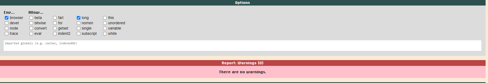

Back to [README.md](/README.md)

- ### Validator Testing
  - HTML Validator
  - [HTML results home page](https://validator.w3.org/nu/?doc=https%3A%2F%2Fmariusmilitaru32.github.io%2FMemoryGame%2Findex.html): no errors/warnings
  - [HTML results contact page](https://validator.w3.org/nu/?doc=https%3A%2F%2Fmariusmilitaru32.github.io%2FMemoryGame%2Fcontact.html): two warning from EmailJs script
  - CSS Validator
  - [CSS Results](https://jigsaw.w3.org/css-validator/validator?uri=https%3A%2F%2Fmariusmilitaru32.github.io%2FMemoryGame%2Findex.html&profile=css3svg&usermedium=all&warning=1&vextwarning=&lang=en): no errors/warnings
  
  JavaScript JsLint Tests
   - count.js  Two ignore options have been selected for the JavaScript test: the first one to ignore long lines and the other one to use a browser environment. No warnings are left.
   - script.js    3 warning, 2 for variables declared inside the loop and one for the arrow function.   
   - email.js     Three options have been selected in JSLint to include the browser environment, allow console.log(), and handle long lines. Afterward, two warnings are displayed from the emailjs code.

- ### Browser Compatibility
  - Testing has been carried out on the following browsers with no issues:
    - Chrome Version 119.0.6045.124 (Official Build) (64-bit)
    - Firefox Version 119.0.1 (64-bit)
    - Edge Version 119.0.2151.58 (Official build) (64-bit)
   - No issues/warnings are being reported in the browser console.:
   - 
   - 

- ### User Story Testing
  
| User Story                                                                                                  | Screenshot                                         |
| ----------------------------------------------------------------------------------------------------------- | -------------------------------------------------- |
| As a first time visitor, I want to easily understand how I to play the game.                                | |
| As a first time visitor, I want to be able to easily reset the game.                                        |        |
| As a first time visitor, I want to be able to easily start the game.                                        |        |
| As a first time visitor, I want to be able to easily find how I can get in contact with the business owner. |        |
| As a returning visitor, I want to be able to send a quick feedback to the business owner.                   |        |
| As a returning visitor, I want to be able to remember how I can play the game.                              | |

 - ### Lighthouse test
    
   | Page      | Device  | Screenshot                                                    | Notes                                                                                        |
   | --------- | ------- | ------------------------------------------------------------- | -------------------------------------------------------------------------------------------- |
   | Home      | Mobile  |   |                                                                                              |
   | Hone      | Desktop |  |                                                                                              |
   | Contact   | Mobile  | |                                                                                              |
   | Contact   | Desktop | |                                                                                             |

- ### Responsiveness
  The website has been tested on different screen sizes using Google Chrome developer tool simulating devices like Iphone 14 Pro Max, Samsung S20 Ultra and Surface Pro 7.
   - [Iphone 14 Pro Max DevTool Screenshoot](documentation/tests/Iphone14ProMax.png)
   - [Samsung S20 Ultra Screenshoot](documentation/tests/Galaxys20Ultra.png)
   - [Surface Pro](documentation/tests/SurfacePro.png)
   - [My mobile phone](documentation/tests/GalaxyNote20Ultra.PNG)

- ### Manual Testing
| Page |User Action |Expected Results  | Pass/Fail | Comments | 
| :---:   | :---: | :---: | :---: | :---: |
| Home Page | Click on Start button| Start the game including the timer| Pass
|           | Click on Reset during game| Flip back the cards, shuffle them, and reset the moves and timer.| Pass
|           | Click on HowToPlay button| Open a window with game instructions| Pass
|           | Click on Contact button| Redirect to contact page| Pass
|           | Click on playing cards| Cards are being flipped(No more than 2 cards at a time.), and the moves are increasing.| Pass
|           | All cards have been matched| The timer is stopped, and the alert is displayed.| Pass
|Contact Page| Click on Home Button| Redirect to home page| Pass
|            | One field in the contact form is not filled.| Not able to submit the form| Pass
|            | Submit the form| The confirmation message is displayed and the form is submitted | Pass
|            | Pressing Submit button multiple times when submiting the form| Submit button disabled to prevent multiple form submision| Pass
| 404 Page   | Trying to acces a nonexisting page| Automatically redirect to home page in 10 seconds| Pass

- ### Automated testing
  - I thought about using Jest to test my project, but I decided to manually test it this time. I want to get better at using Jest, so I'll practice it separately on another project with a step-by-step approach. In this project, I kept rushing into the code, so I realized I need to slow down and practice with Jest before using it on an important project. 

Back to [README.md](/README.md)